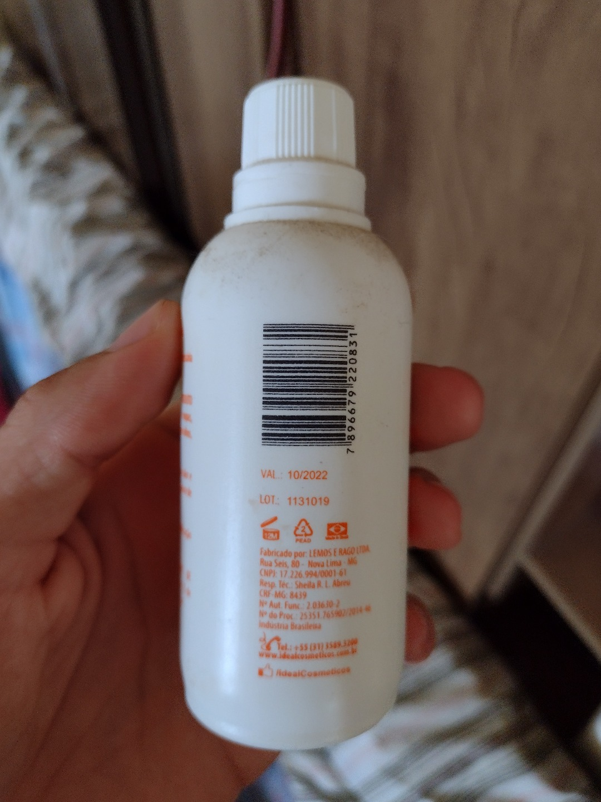

# API OCR Expiration Date
## Exemplo da API funcionando

### Imagem a ser testada


### Teste


## Setup

```
git clone https://github.com/jvclisboa/api-ocr-expiration-date.git

pip install -r requirements.txt
```

## Starting a local server
Na pasta raiz do projeto, execute o seguinte comando para iniciar o servidor local:

```
uvicorn main:app --reload
```